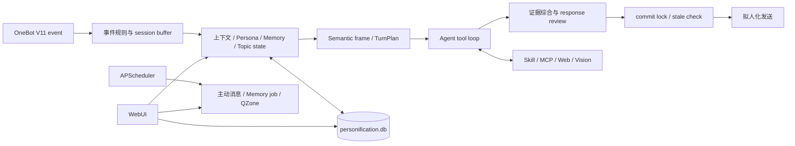

# Personification

面向 NoneBot 2 与 OneBot V11 的拟人化聊天插件。它不只是给 LLM 套一层人设，而是把群聊参与决策、上下文、长期记忆、用户画像、工具调用、媒体理解、发送行为、主动社交、QQ 空间和运维控制台组合成一套完整运行时。

当前仓库是源码型插件，不是独立发布的 PyPI package。仓库默认放在 NoneBot 项目的 `plugin/personification`，由 `plugin_dirs = ["plugin"]` 自动加载。

## 设计原则

- 对话语义由 LLM 决定。代码负责事实、上下文、权限、预算、契约、持久化和安全兜底，不用关键词表代替“要不要回复、用户在说什么、该调用什么工具”等语义判断。
- 普通聊天采用 TurnPlan、Agent tool loop 和可选 response review；模型可以回复、追问、查证、执行动作或保持沉默。
- 有外部副作用的工具显式声明 `side_effect`、`final_behavior` 和 `retryable`，成功外发后可以静默收尾，避免重复发送。
- 回复提交有 session lock、stale check 和抢占边界，降低慢回复插入错误话题、同一轮重复发送等并发问题。
- QQ 空间发布使用持久化 Operation ledger。结果不确定时保持 `unknown`，禁止自动重发，优先远端精确对账。
- 所有高风险自动行为都有主开关、额度、冷却或权限边界；默认关闭 QQ 空间、TTS、Social Intelligence、远程 Skill 和插件代调用等能力。

## 主要能力

| 领域 | 当前能力 |
|---|---|
| 群聊与私聊 | 白名单群、私聊、被 @、引用、随机插话、戳一戳、多人并行话题、短期 thread state、回复缓冲和过期提交拦截 |
| Agent | TurnPlan、`speech_act`、工具筛选、多步 tool call、证据综合、Provider fallback、预算 shadow/adaptive、Trace |
| 人设与关系 | 全局/群人设、角色模板构建、群风格学习、用户画像、结构化画像更正、好感度、inner state |
| 记忆 | 会话历史、摘要压缩、长期 memory item、RAG、向量索引、衰减、整合、结晶、Memory Palace 和关系图 |
| 联网与工具 | Provider 原生搜索、Web Search、Web Fetch、Wiki、天气、新闻、游戏信息、ACG 实体解析、资源与图片检索、用户任务 |
| 图片与媒体 | 图片输入、GIF 采样理解、可选视频理解、视觉 fallback、图片生成、表情包语义选择/发送/打标/整理 |
| 拟人发送 | 按生成耗时补足打字延迟、短消息分段、引用、@、消息 reaction、拍一拍、私聊输入状态和可选低概率错别字 |
| 主动行为 | 主动私聊、早晚问候、新闻推送、话题跟进、节日祝福、群空闲话题和状态驱动的主动表达 |
| QQ 空间 | QR 登录、自动/手动说说、好友动态点赞评论、评论回响、转发、月度额度、幂等发布、远端对账和历史漏记补记 |
| 管理与观测 | WebUI、配置热更新、Provider/模型测试、功能体检、Token/额度、Agent 状态、Trace、审计、日志、数据迁移和插件更新 |

## 运行架构



主要目录：

| 目录 | 职责 |
|---|---|
| `agent/` | Agent runtime、planner、tool loop、final synthesis、ToolRegistry、inner state |
| `core/` | Provider/模型路由、配置、数据库、Memory、Persona、QZone、诊断、安全和运行时组装 |
| `handlers/` | NoneBot matcher、消息采集、普通/YAML reply pipeline、命令和拟人发送 |
| `flows/` | 主动消息、日记/说说、QQ 空间社交与其它跨步骤流程 |
| `jobs/` | APScheduler 注册与后台任务构建 |
| `skills/skillpacks/` | 内置 Skill 内容、工具实现和说明 |
| `skill_runtime/` | 内置、本地、远程、隔离进程与 MCP Skill loader |
| `webui/` | FastAPI routes 与无构建步骤的静态管理前端 |
| `tests/` | 单元、契约、静态门禁和脱敏回放集 |

更细的目录示例见 [DIRECTORY_GUIDE.md](DIRECTORY_GUIDE.md)。

## 环境要求

- Python `>=3.9,<4.0`。
- NoneBot 2 `>=2.4.4`，使用 FastAPI Driver。
- OneBot V11 adapter `>=2.4.6`。
- `nonebot-plugin-apscheduler` 是硬依赖，缺失时插件会拒绝加载。
- NapCat、Lagrange.OneBot、LLOneBot 和 go-cqhttp 可承载标准 OneBot 能力；reaction、输入状态、部分拍一拍与 QQ 空间能力取决于具体实现端。
- SQLite 用于主要持久化；安装 `aiosqlite` 时使用异步访问，否则保留运行时 fallback。
- 若使用 HTML 渲染或相关图片能力，需要 Playwright Chromium。

本项目宿主的完整依赖清单位于上级项目 `pyproject.toml`。在宿主项目根目录安装：

```powershell
python -m pip install -e .
python -m playwright install chromium
```

只把本仓库接入其它 NoneBot 项目时，至少安装以下运行依赖；按实际启用的媒体和 Skill 能力补充可选依赖：

```powershell
python -m pip install "nonebot2[fastapi,httpx]>=2.4.4" "nonebot-adapter-onebot>=2.4.6" "nonebot-plugin-apscheduler>=0.5.0" "nonebot-plugin-htmlrender>=0.3.6" "nonebot-plugin-alconna>=0.62.0" "nonebot-plugin-uninfo>=0.11.0" "nonebot-plugin-localstore>=0.7.4" "aiohttp>=3.10.0" "aiosqlite>=0.20.0" "ruamel.yaml>=0.18.0" "python-dateutil>=2.9.0" "Pillow>=10.4.0" "pillow-avif-plugin>=1.5.2" "filelock>=3.13.1" "openai>=1.50.0" "google-generativeai>=0.8.0" "anthropic>=0.30.0" "playwright>=1.50.0" "watchdog>=4.0.0" aiofiles beautifulsoup4 emoji imageio-ffmpeg msgspec yt-dlp
```

## 安装

在 NoneBot 项目根目录执行：

```powershell
git clone https://github.com/luojisama/personification.git plugin/personification
```

确认项目的 `pyproject.toml` 包含：

```toml
[tool.nonebot]
plugin_dirs = ["plugin"]

[tool.nonebot.adapters]
nonebot-adapter-onebot = [
    { name = "OneBot V11", module_name = "nonebot.adapters.onebot.v11" }
]
```

启动 Bot：

```powershell
nb run
```

启动日志应出现拟人插件运行时初始化、Skill 加载和 WebUI 路由挂载信息。WebUI 只在 FastAPI Driver 下安装；其它 Driver 会跳过 WebUI，但不影响聊天 matcher。

## 最小配置

下面示例使用一个 OpenAI-compatible Provider。`personification_api_pools` 必须写成单行 JSON，避免 dotenv 对多行 JSON 截断。

```dotenv
DRIVER=~fastapi
HOST=127.0.0.1
PORT=8080
SUPERUSERS=["123456789"]

personification_whitelist=["987654321"]
personification_api_pools=[{"name":"primary","api_type":"openai","api_url":"https://example.com/v1","api_key":"replace-me","model":"your-model","priority":0}]
```

不使用 Provider pool 时可保留 legacy 单 Provider 配置：

```dotenv
personification_api_type=openai
personification_api_url=https://example.com/v1
personification_api_key=replace-me
personification_model=your-model
```

API Key、OAuth credential 和 QQ 空间 Cookie 都是 secret，不要提交到 Git。推荐在首次启动后通过 WebUI 配置中心管理；运行时配置会持久化到插件数据目录，并在重启时恢复。

## Provider 与模型路由

支持以下 `api_type`：

| `api_type` | 鉴权方式 | 备注 |
|---|---|---|
| `openai` | `api_url` + `api_key` | OpenAI-compatible Chat/Responses route |
| `gemini` | `api_url` + `api_key` | Gemini official/compatible route |
| `anthropic` | `api_url` + `api_key` | Anthropic Messages route |
| `openai_codex` | Codex OAuth | 默认查找 `~/.codex/auth.json`，可指定 `personification_codex_auth_path` |
| `gemini_cli` | Gemini CLI OAuth | 默认查找 Gemini credential，可指定 auth path/project |
| `antigravity_cli` | Antigravity/Gemini OAuth | 支持独立 proxy、auth path 和 project |
| `claude_code` | Claude Code OAuth | 默认查找 Claude credential，可指定 `personification_claude_code_auth_path` |

Provider pool 每项可设置 `name`、`api_type`、`api_url`、`api_key`、`model`、`auth_path`、`project`、`proxy`、`enabled`、`priority`、`timeout`、`max_retries` 和原生搜索能力。正常聊天支持按优先级 fallback、失败冷却和动态健康排序。

`personification_model_overrides` 可按角色覆盖模型，例如 `agent`、`intent`、`review`、`sticker`；也可以使用 `personification_lite_model` 承担轻量分类和 review。QQ 内使用 `拟人 模型 ...`，或在 WebUI 的配置中心与模型测试页调整。

## 关键配置

Config model 当前包含数百个字段。下面只列启动、风险和行为边界；完整字段、默认值、类型、scope、热更新状态和风险说明以 WebUI 配置中心或 `拟人 配置 列表` 为准。

### 基础聊天

| 配置 | 默认值 | 作用 |
|---|---:|---|
| `personification_whitelist` | `[]` | 允许插件参与的群号；私聊不受群白名单限制 |
| `personification_global_enabled` | `true` | 全局聊天总开关 |
| `personification_probability` | `0.30` | 非明确呼叫场景的参与概率基础值 |
| `personification_agent_enabled` | `true` | 启用完整 Agent tool loop |
| `personification_agent_max_steps` | `10` | 单轮 Agent 最大步骤 |
| `personification_agent_budget_mode` | `shadow` | `shadow` 仅观测预算；`adaptive` 才接管实际步数和 deadline |
| `personification_response_timeout` | `180` | 单轮回复总超时秒数 |
| `personification_reply_session_concurrency` | `3` | 单 session 并发上限 |
| `personification_reply_global_concurrency` | `12` | 全局回复并发上限 |
| `personification_system_prompt` | 内置群友人设 | 默认系统人设，可改用 prompt file |
| `personification_timezone` | `Asia/Shanghai` | 作息、任务和日期工具时区 |

### Memory、Persona 与观测

| 配置 | 默认值 | 作用 |
|---|---:|---|
| `personification_memory_enabled` | `true` | 长期 Memory 总开关 |
| `personification_memory_palace_enabled` | `true` | Memory Palace 与关系能力 |
| `personification_memory_rag_enabled` | `true` | 长期 Memory 检索注入 |
| `personification_memory_decay_enabled` | `true` | Memory 衰减任务 |
| `personification_memory_consolidation_enabled` | `true` | Memory 整合 |
| `personification_persona_enabled` | `true` | 用户画像生成与注入 |
| `personification_favorability_enabled` | `true` | 用户/群好感度 |
| `personification_turn_trace_enabled` | `true` | 记录 Agent 阶段 Trace |
| `personification_data_dir` | LocalStore 目录 | 显式指定全部插件运行数据目录 |

### 默认关闭或高风险能力

| 配置 | 默认值 | 启用前确认 |
|---|---:|---|
| `personification_qzone_enabled` | `false` | 会读取或写入真实 QQ 空间，先完成 QR 登录和额度设置 |
| `personification_tts_enabled` | `false` | 需要 TTS API Key，可能产生外部费用 |
| `personification_social_intelligence_enabled` | `false` | 会主动向用户或群发送消息 |
| `personification_plugin_invoker_enabled` | `false` | 允许 Agent 触发其它插件命令，应配置 allowlist/blocklist |
| `personification_plugin_knowledge_build_enabled` | `false` | 会后台扫描插件并调用模型构建知识 |
| `personification_skill_remote_enabled` | `false` | 会下载远程 Skill；默认还要求管理员审批和隔离执行 |
| `personification_skill_allow_unsafe_external` | `false` | 开启后外部 Skill 可进入宿主进程，不建议开启 |
| `personification_git_auto_update` | `false` | 会定时拉取源码，更新后仍需重启 |
| `personification_humanize_typo_probability` | `0.0` | 非零时闲聊可能故意产生并修正错别字 |
| `personification_humanize_proactive_poke_enabled` | `false` | 会主动拍一拍 |

注意：部分子功能默认值为 `true`，但仍受其上层 master switch 约束。例如 QZone proactive/social/inbound 的默认值不会绕过 `personification_qzone_enabled=false`。

## QQ 命令

命令受 NoneBot `command_start` 影响。统一入口支持中文 `拟人`、`人格` 和英文 `/persona`；最准确的在线帮助始终是：

```text
拟人 帮助
```

### 统一管理入口

| 命令 | 权限 | 用途 |
|---|---|---|
| `拟人 帮助 [分类/配置项]` | 可用用户 | 命令总览、分类帮助或字段说明 |
| `拟人 状态` | 管理员 | 运行、Memory、联网和后台状态 |
| `拟人 配置 列表 [全局/群]` | 管理员 | 列出配置、当前值、默认值和 scope |
| `拟人 配置 查看 <配置项> [当前群/群号]` | 管理员 | 查看字段详情和风险 |
| `拟人 配置 设置 <配置项> <值> [当前群/群号]` | 管理员 | 热更新或持久化配置 |
| `拟人 配置 重置 <配置项> [当前群/群号]` | 管理员 | 恢复默认值 |
| `拟人 管理员 列表/添加/删除` | Superuser | 管理插件管理员 |
| `拟人 记忆 状态/补建/衰减/演化/结晶 执行` | 管理员 | Memory 运维 |
| `拟人 迁移 状态/执行` | 管理员 | 旧数据迁移 |
| `拟人 召回 统计` | 管理员 | 长期 Memory recall 统计 |
| `拟人 模型 列表/路由/使用/设置/重置` | 管理员 | Provider 与阶段模型热切换 |
| `拟人 定时 状态` | 管理员 | APScheduler job、下次执行和开关 |
| `拟人 空间 状态/测试/消息` | 管理员 | QZone 状态、指定好友测试和留言轮询 |
| `拟人 表情包 整理/清理/回滚` | 管理员 | 表情包维护 |
| `拟人 人设构建 <作品名> <角色名>` | 管理员 | 从资料构建 Persona template |
| `拟人 更新` | Superuser | 检查并拉取插件更新 |

### 常用兼容命令

| 命令 | 权限 | 用途 |
|---|---|---|
| `开启拟人` / `关闭拟人` | Superuser | 当前群聊天开关 |
| `开启表情包` / `关闭表情包` | Superuser | 当前群表情包开关 |
| `开启语音回复` / `关闭语音回复` | Superuser | 当前群语音开关 |
| `拟人开关` / `拟人语音` / `拟人联网` / `拟人主动消息` | Superuser | 全局快速开关 |
| `拟人作息` | Superuser | 当前群或全局作息模拟 |
| `设置人设` / `查看人设` / `重置人设` | Superuser | 群 Persona 管理 |
| `学习群聊风格` | Superuser | 重新分析当前群风格 |
| `查看群聊风格 [群号]` | 可用用户 | 查看已保存的群风格 |
| `群好感` / `群好感度` | 群成员 | 查看当前群好感度 |
| `设置群好感 [群号] [数值]` | Superuser | 修改群好感度 |
| `查看画像` / `刷新画像` | 白名单内用户 | 查看或重建自己的画像 |
| `清除记忆` / `完全清除记忆` | Superuser | 清理指定或全部会话与长期 Memory |
| `申请白名单` | 群成员 | 申请当前群接入 |
| `同意白名单` / `拒绝白名单` / `添加白名单` / `移除白名单` | Superuser | 群准入管理 |
| `永久拉黑` / `取消永久拉黑` / `永久黑名单列表` | Superuser | 用户封禁管理 |
| `发个说说` | Superuser | 生成并发布一条 QQ 空间说说 |
| `说` / `朗读` / `配音` | 可用用户 | 显式 TTS；支持 mode、voice、style、clone 参数 |
| `重打标表情包 [筛选词]` | Superuser | 后台重新生成表情语义标签 |
| `远程技能审批` / `安装远程技能` | Superuser | 远程 Skill 管理 |
| `重建/删除/清空插件知识库` | Superuser | Plugin Knowledge 运维 |
| `拟人额度` / `拟人统计` | Superuser | Provider quota 与运行统计 |

旧命令保留用于兼容，新增管理能力优先放在统一入口和 WebUI。

## WebUI

FastAPI Driver 启动后访问：

```text
http://<host>:<port>/personification/
```

默认 `HOST=127.0.0.1` 时仅本机可访问。若 `HOST=0.0.0.0`，日志会输出局域网访问提示；公网部署建议使用 HTTPS reverse proxy，不要直接暴露明文 HTTP。

WebUI 页面覆盖：

- Agent 状态、仪表盘、功能体检、Provider quota。
- QQ 空间状态、QR 登录、发布、对账和历史补记。
- 配置中心、Provider/模型探测和 hot reload。
- 用户画像、群信息、群开关、群风格与群知识。
- Agent Memory、Memory graph、recall test 和向量重建。
- 表情包、Skill/MCP、Plugin Knowledge、插件更新和模型测试。
- Persona 预览、角色模板构建、主动行为诊断和消息 Trace。
- UserPolicy / Blacklist（从指定 Bot 好友选取或手工输入 QQ、临时/永久加入、完整解除和事件时间线）、近期 Bot 消息。
- 数据导入导出、审计日志、插件日志、QQ 账号管理和设备管理。

### 登录与安全

- 只有 NoneBot `SUPERUSERS` 或插件管理员可以发起登录。
- 登录页直接读取并列出 `SUPERUSERS` 与插件管理员，不接受自行输入管理员 QQ。
- 验证码通过 Bot 私聊发送，5 分钟有效，并与发起登录的浏览器 challenge 绑定。
- 验证码成功后设备立即可用，不再要求另一台已登录设备二次审批。
- 有效 Session cookie 内不重复验证；退出、撤销或 7 天到期后必须重新接收管理员验证码，不再使用可伪造的 User-Agent 作为免验证凭据。
- Session cookie 为 `HttpOnly`、`SameSite=Lax`，写请求还需要 CSRF token。
- HTTPS 由 request scheme 或 `X-Forwarded-Proto: https` 识别，并据此设置 Secure cookie。
- 登录发送按来源 IP 限速，同一浏览器 challenge 60 秒内不可重发；并行浏览器 challenge 互不覆盖。设备状态、危险写操作和管理员行为会记录审计日志。
- 管理员权限被撤销后，已有 WebUI Session 会在下次请求时失效。

## QQ 空间一致性

QQ 空间基于非官方接口，必须把“请求返回”和“远端确实只执行一次”分开处理。插件为每次外发创建 Operation ID，并持久化以下状态：

| 状态 | 含义 | 自动处理 |
|---|---|---|
| `reserved` | 已占用额度，尚未确认 dispatch | 过期且确定未 dispatch 时可释放 |
| `dispatching` | 已开始外部请求 | 过期后转 `unknown`，不重发 |
| `succeeded` | 远端成功且本地 projection 已提交 | 不重发 |
| `definite_failure` | 确定未成功 | 可由新 Operation 再试 |
| `unknown` | timeout、连接中断或响应不可判定 | 永不自动重发，先查 QQ 空间 |

一致性边界：

- 月度额度区分 `confirmed`、`held` 和 `available`；`unknown`、`dispatching` 与有效 reservation 会占 held quota。
- 同一成功 Operation、月度用量和最近发布状态在同一 SQLite transaction 中提交。
- 自动对账只接受 Bot 身份、规范化正文 hash、时间窗口内的唯一精确匹配；转发还要求源动态 identity 一致。
- 无匹配或多匹配不会模糊认领，继续保持 `unknown`。
- 管理员确认远端确实不存在后，才可把 `unknown` 解除为 `definite_failure`。
- 历史漏记只能从重新读取的 Bot 本人远端动态中选择并确认，服务端会二次读取验证。
- 遇到“发布结果未知”时不要直接再次点击发布；先打开真实 QQ 空间核对，再使用 WebUI 对账。

启用建议：

1. 在 WebUI QQ 空间页完成 QR 登录，确认 Cookie 可刷新。
2. 设置 `personification_qzone_monthly_limit`、quiet hours、最小间隔和扫描范围。
3. 先关闭 proactive/social，仅做一次手动发布与读取测试。
4. 核对 Operation ledger 和远端内容后，再逐项开启自动发表、互动、转发或评论回响。

## Skill 与 MCP

内置能力包括 Web Search、Web Fetch、Wiki、天气、日期时间、新闻、游戏信息、ACG 实体、并行研究、资源/图片检索、图片生成、视觉分析、表情包、Memory、用户任务、用户画像、群信息、好友请求和 Plugin Knowledge。

自定义 Skill 可以来自：

- `personification_skills_path` 指定的本地目录。
- 本地 zip 或目录 source。
- 直接 zip URL。
- GitHub repository URL，可指定 ref 和 subdir。
- MCP stdio server。

远程 source 默认按不可信输入处理：需要管理员 review，优先使用子进程 isolation 或 MCP；只有显式打开 `personification_skill_allow_unsafe_external` 才允许不可信 Skill 在宿主进程执行 `build_tools()` / `register()`。

WebUI 的 Skill 页面还提供托管 MCP 安装：可搜索 Official MCP Registry 或配置的兼容 HTTPS Registry，并快捷预检 npm/npx、PyPI/uvx 的 stdio package。托管安装只接受精确版本和公共官方 package registry，不支持自定义 runtime argument、Secret command-line argument 或 Streamable HTTP。Registry metadata 和 tool annotation 均按不可信输入处理；安装后所有 tool 默认关闭，管理员查看名称、说明和 publisher 风险声明后逐项确认启用。

MCP Secret 只允许通过环境变量传给子进程，独立保存在 `personification_mcp_secret_file` 或数据目录 `mcp/secrets.json`，不会写入数据库、WebUI response、审计详情或日志。快捷安装会以 Bot 系统用户权限执行第三方 package；Registry 命名空间验证不等于安全审计，安装前仍应检查源码和 package identity。

Skill 标准结构、metadata、isolation 与 MCP 示例见 [DIRECTORY_GUIDE.md](DIRECTORY_GUIDE.md)。

## 数据与备份

默认数据目录由 `nonebot-plugin-localstore` 提供；不可用时回退到 `data/personification`。可用 `personification_data_dir` 显式覆盖。

主要数据包括：

- `personification.db`：session/group message、thread、Persona、Memory、用户任务、Token ledger、QZone Operation、额度和其它 KV 状态。
- `env.json` 与 runtime config：WebUI/命令保存的运行配置。
- `plugin_knowledge/`：已构建的插件知识。
- `skill_cache/`：远程 Skill cache。
- `mcp/secrets.json`、`mcp/runtime/`：托管 MCP 的受限 Secret 文件与隔离工作目录。
- `persona_templates/`、`persona_template_exports/`、`persona_avatar_candidates/`：Persona 构建产物。
- `data_transfer/`：管理员显式创建的导入导出任务文件。
- 表情包目录默认是项目级 `data/stickers`，可用 `personification_sticker_path` 修改。

升级或迁移前至少备份整个插件数据目录和表情包目录。不要只备份 JSON；主要运行状态已经进入 SQLite。WebUI 的数据迁移页提供导出、预检和应用流程，破坏性操作应先查看 Operation diagnostic 和审计日志。

## 运维与排错

建议按以下顺序定位问题：

1. WebUI“功能体检”确认 Bot、Provider、模型、Skill、QZone 和外部依赖状态。
2. WebUI“Agent 状态”和“消息 Trace”确认 TurnPlan、tool call、budget、review 和发送阶段。
3. WebUI“插件日志”按 level、query、Trace ID 筛选。
4. 使用“模型测试”单独验证 Provider 和 vision route。
5. QQ 空间异常先看 Operation ID 和状态，不要先重试外部写入。

常见边界：

- FastAPI Driver 不可用时 WebUI 不挂载。
- Bot 离线或管理员不是 Bot 好友时，WebUI 无法发送登录验证码。
- reaction、输入状态、拍一拍和 QQ 管理的扩展 API 会按 OneBot 实现端探测降级。
- QQ 空间是非官方能力，Cookie、接口字段和风控可能随 QQ 客户端变化。
- Provider 原生 search 不可用时可回落外部 Web Search；海外站点访问仍受服务器网络和 proxy 配置影响。
- Memory、主动行为、群风格和 Persona 的质量依赖真实运行数据；单元测试通过不等于生产聊天自然度已经稳定。
- `personification_agent_budget_mode=shadow` 只记录建议预算，不会改善实际延迟；需要灰度验证后再切 `adaptive`。
- 当前回放集是冷启动样本，仍需持续补充脱敏的真实坏例。

## 开发与验证

以下命令从宿主项目根目录执行。

安装开发依赖：

```powershell
python -m pip install -e ".[dev]"
```

完整测试：

```powershell
python -m pytest plugin/personification/tests
```

只验证当前插件目录时：

```powershell
python -m pytest tests
```

对话语义静态门禁用于阻止在核心对话模块中重新引入 keyword/regex semantic routing：

```powershell
python -m tools.personification_semantic_scan
```

离线聊天场景模拟：

```powershell
python -m tools.personification_chat_sim list --json
python -m tools.personification_chat_sim run all --json
```

脱敏回放报告：

```powershell
python plugin/personification/scripts/replay_corpus.py --input plugin/personification/tests/replay_corpus/*.jsonl --output replay_report.md
```

WebUI JavaScript 静态门禁：

```powershell
node --check plugin/personification/webui/static/app-core.js
node --check plugin/personification/webui/static/app-admin.js
node plugin/personification/tests/test_qzone_webui_static.js
```

提交前至少运行与改动相关的定向测试、完整 pytest、chat simulation、semantic scan、JavaScript syntax check 和 `git diff --check`。涉及真实 Provider、OneBot 扩展 API、QQ 空间或公网 WebUI 时，还需要在部署环境做独立 smoke test。

## 维护约定

- 新的正常聊天语义判断继续由 LLM metadata / TurnPlan 承担，不新增关键词表、短语表或 regex semantic router。
- 新的外发工具必须声明副作用、最终回复行为和重试安全性。
- `CancelledError` 应传播；认证失败、模型不存在和缺少 caller 等确定性错误应快速失败。
- 同一业务流程只能有一个 retry owner，避免 Agent、Provider 和 SDK 多层重试放大请求。
- 修改 `Config` 字段时同步更新 Config registry 和 coverage test。
- 修改 prompt 时同步更新 `core/prompts/VERSIONS.md`。
- 修改 WebUI 写操作时返回稳定 Operation diagnostic，不向前端暴露 raw exception。
- 不提交 `.env`、API Key、OAuth credential、Cookie、数据库、运行日志、Skill cache 或用户数据。

## License

当前仓库未提供独立 LICENSE 文件。除非仓库所有者补充明确许可，否则不要假设源码可以被重新授权、打包发布或用于闭源再分发。
